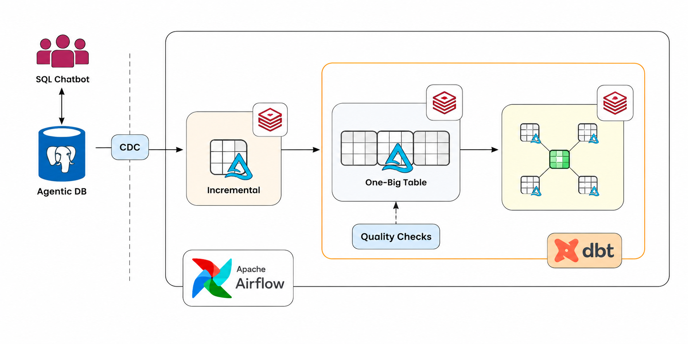
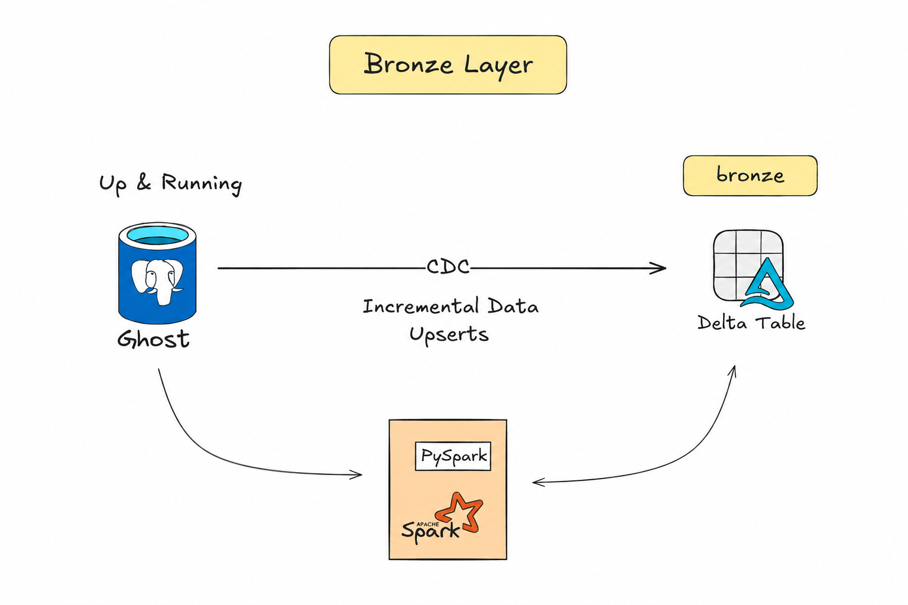
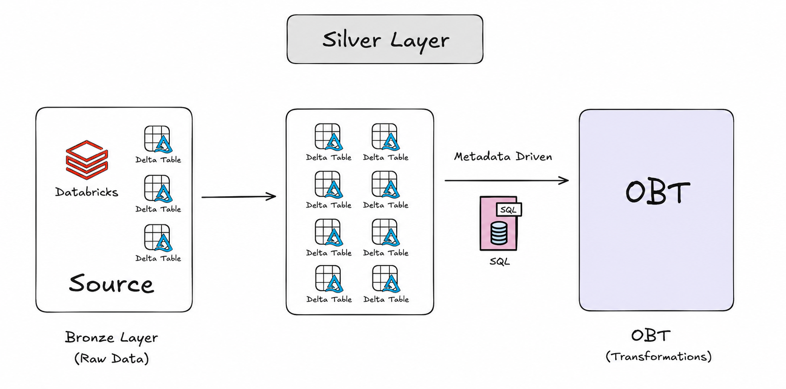
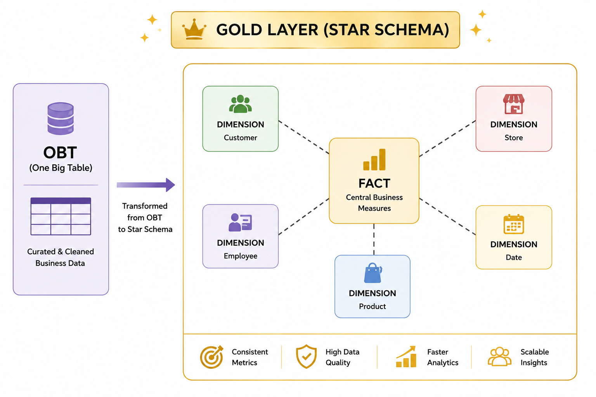

# 🛒 DataForge Commerce Platform

> **Production-inspired End-to-End Commerce Data Engineering Platform built using Apache Airflow, Databricks, Delta Lake, dbt, PostgreSQL, Apache Spark, CDC, and Docker.**

---

# 📌 Project Overview

**DataForge Commerce Platform** is an end-to-end data engineering project designed to simulate a modern retail and commerce data platform.

The project processes Walmart-style retail transactional data from a PostgreSQL-compatible operational source database and incrementally ingests the data into a Databricks Lakehouse using Change Data Capture (CDC).

The platform follows a **Medallion Architecture**, where data moves through Bronze and Silver processing layers before being transformed into analytics-ready dimensional models using **dbt**.

The final Gold layer implements a **Dimensional Data Model (DDM)** with a Star Schema, while **Apache Airflow** orchestrates the overall data pipeline.

---

# 🚀 Key Features

- 🔄 Change Data Capture (CDC) and Incremental Data Ingestion
- 🗄️ PostgreSQL-Compatible Source Database
- 🧱 Databricks Lakehouse Architecture
- 🥉 Bronze / Silver / Gold Medallion Architecture
- ⚡ Apache Spark & Delta Lake
- 📊 One Big Table (OBT)
- 🧪 Data Quality Checks
- 🔧 dbt Transformations & Incremental Models
- 🧩 Reusable dbt Macros
- ⭐ Star Schema & Dimensional Data Modeling
- 🕒 Slowly Changing Dimensions (SCD)
- ⚙️ Apache Airflow Orchestration
- 🐳 Dockerized Airflow Environment
- 🐍 Python & SQL

---

# 🏗️ Solution Architecture



The platform follows a modern data engineering architecture:

```text
PostgreSQL-Compatible Source Database
                 │
                 │ CDC / Incremental Updates
                 ▼
          Databricks Bronze
                 │
                 ▼
        Spark Transformations
                 │
                 ▼
         Silver / OBT Layer
                 │
                 ▼
         Data Quality Checks
                 │
                 ▼
          dbt Transformations
                 │
                 ▼
          Gold / DDM Layer
                 │
                 ▼
             Star Schema

        Apache Airflow
     Orchestrates the Workflow
````

---

# 🔄 End-to-End Data Flow

## 1️⃣ Source Data

The project uses a **PostgreSQL-compatible operational database** hosted through the Agentic DB / Ghost environment.

The source schema is created using the project's DDL script:

```text
ddl/
└── walmart_schema.sql
```

The Walmart-style retail datasets are stored as CSV files and loaded into the corresponding source tables.

The data preparation workflow uses **Python, VS Code, and MCP-assisted database interaction**.

---

## 2️⃣ CDC & Incremental Ingestion

Changes from the source database are processed using a **CDC-based incremental ingestion approach**.

Instead of repeatedly processing the complete source dataset, the pipeline focuses on newly inserted or changed records.

```text
Source Database
      │
      │ CDC
      ▼
Incremental / Changed Records
      │
      ▼
Databricks Bronze
```

This enables the platform to process data incrementally and reduce unnecessary full-data processing.

---

# 🥉 Bronze Layer

The Bronze layer acts as the raw ingestion layer inside Databricks.

Source data is incrementally loaded into **Delta Tables**, providing a reliable foundation for downstream processing.

### Bronze Layer Responsibilities

* Capture incremental source updates
* Store ingested data using Delta Lake
* Preserve source-level data
* Support downstream Spark transformations



---

# 🥈 Silver Layer

The Silver layer processes and enriches the Bronze data using **Apache Spark**.

Multiple datasets are transformed and combined to create a consolidated **One Big Table (OBT)**.

```text
Bronze Tables
     │
     ├── Orders
     ├── Customers
     ├── Products
     └── Other Business Entities
              │
              ▼
      Spark Transformations
              │
              ▼
        One Big Table
```

The OBT provides a unified business-level dataset that serves as the foundation for downstream analytical transformations.



---

# 🧪 Data Quality

Data quality checks are performed on the transformed data before it moves into the final analytical layer.

The validation process helps identify issues such as:

* Null values
* Duplicate records
* Invalid data
* Primary key violations
* Referential integrity issues

Only validated data is promoted to downstream analytical models.

---

# 🔧 dbt Transformation Layer

**dbt** is used to build and manage SQL-based transformation models.

The dbt project includes:

* Source definitions
* Staging models
* Intermediate transformations
* Incremental models
* Dimensional models
* Data tests
* Reusable macros

The transformation flow is:

```text
Databricks Source
       │
       ▼
dbt Sources
       │
       ▼
Staging Models
       │
       ▼
Intermediate Models
       │
       ▼
Dimensional Models
```

Reusable dbt macros are used to standardize transformation and schema-related logic across the project.

---

# 🥇 Gold Layer

The Gold layer contains analytics-ready data models built using **Dimensional Data Modeling (DDM)** principles.

The final model follows a **Star Schema** consisting of:

### Fact Tables

Contain measurable business events and transactional data.

### Dimension Tables

Provide descriptive context for analytical queries.

The Gold layer is designed for:

* Analytical SQL queries
* Business Intelligence
* Reporting
* Data visualization
* Aggregation



---

# ⭐ Star Schema & SCD

The final data model follows a Star Schema architecture.

```text
                 Dimension
                     │
                     │
Dimension ─────── Fact ─────── Dimension
                     │
                     │
                 Dimension
```

The project also demonstrates **Slowly Changing Dimensions (SCD)** to manage changes in dimensional attributes over time.

Both **SCD Type 1 and Type 2** patterns are incorporated where applicable.

---

# ⚙️ Apache Airflow Orchestration

Apache Airflow is used to orchestrate the end-to-end workflow.

The pipeline manages dependencies between ingestion, transformation, validation, and downstream modeling tasks.

```text
Source Data
    │
    ▼
CDC / Incremental Ingestion
    │
    ▼
Bronze Processing
    │
    ▼
Spark / Silver Processing
    │
    ▼
One Big Table
    │
    ▼
Data Quality
    │
    ▼
dbt Transformations
    │
    ▼
Gold Data Models
```

Airflow provides scheduling, task dependencies, retries, and pipeline monitoring.


---

# 🛠️ Tech Stack

<p align="center">
  
</p>

<p align="center">
  Python • SQL • PostgreSQL • Apache Airflow • Databricks • Apache Spark • Delta Lake • dbt • Docker • Git • GitHub
</p>

---

# 📂 Project Structure

```text
dataforge-commerce-platform
│
├── airflow
│   └── dags
│
├── databricks
│   ├── bronze
│   ├── silver
│   └── gold
│
├── dbt
│   ├── models
│   ├── macros
│   ├── tests
│   └── dbt_project.yml
│
├── data
│   └── walmart_dataset
│       └── data
│
├── ddl
│   └── walmart_schema.sql
│
├── images
│   ├── architecture.png
│   ├── bronze_layer.png
│   ├── silver_layer.png
│   ├── gold_layer.png
│   └── airflow_dag.png
│
├── requirements.txt
├── docker-compose.yml
├── .gitignore
└── README.md
```

---

# 🎯 Key Data Engineering Concepts

This project demonstrates practical implementation of:

* Change Data Capture (CDC)
* Incremental Data Ingestion
* Medallion Architecture
* Databricks Lakehouse
* Delta Lake
* Apache Spark
* One Big Table (OBT)
* Data Quality Validation
* dbt Transformations
* dbt Macros
* Incremental dbt Models
* Dimensional Data Modeling
* Star Schema
* Slowly Changing Dimensions
* Apache Airflow Orchestration
* Dockerized Data Engineering Environment

---

# 👨‍💻 Author

**Avinash Kamble**

Aspiring Azure Data Engineer

---

⭐ If you found this project useful, feel free to explore the repository and connect with me.

